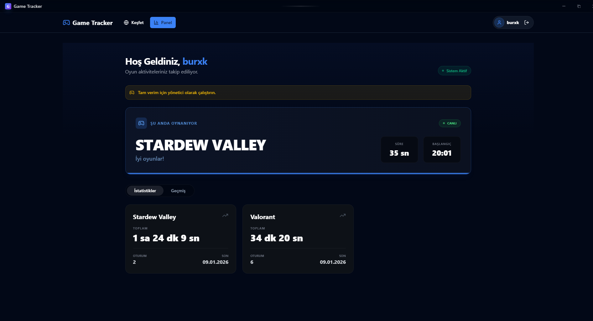
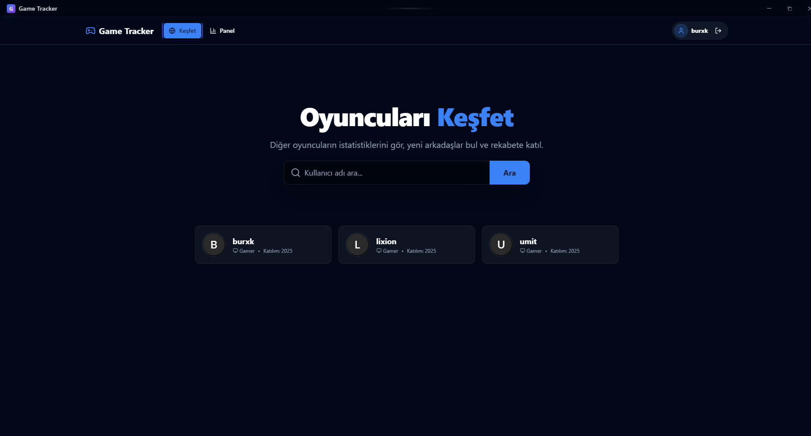
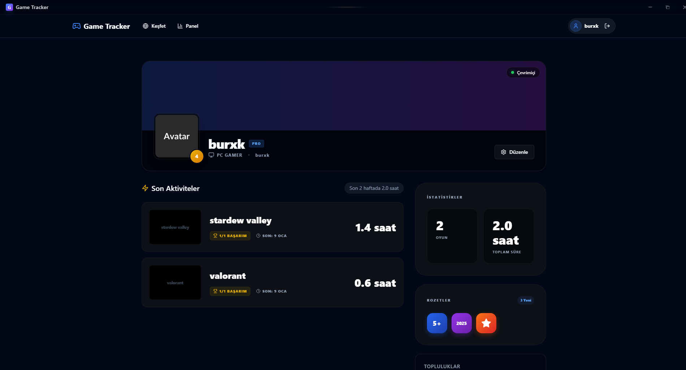

# The Game Tracker

Game Tracker is an application that allows you to record the playtime of your original or cracked games, communicate with other users, and create your profile.

The application is not for downloading games; it allows you to take screenshots of even your cracked games, track playtime, and obtain _achievements_.

## Upcoming Features
> Also: Badges, community, messaging, and screenshot sharing features will be added soon.

## Dashoard Page
The Dashboard Page allows you to access statistics for the games you've played. The "_Playing_" section is also displayed on this page.

## Discover Page
You can explore and search other players' profiles.

## Profile Page
Personalized game profile page: You can add custom avatars and banners. Other users can see your game time, and you can share which games you're playing with other users.

