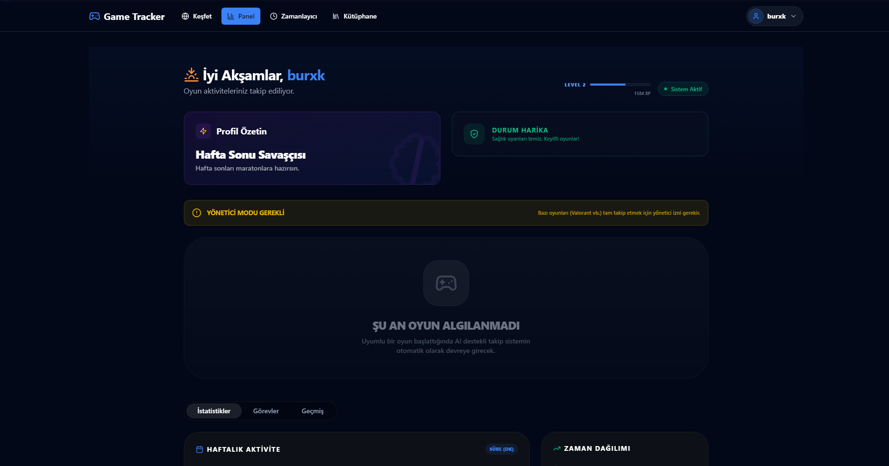
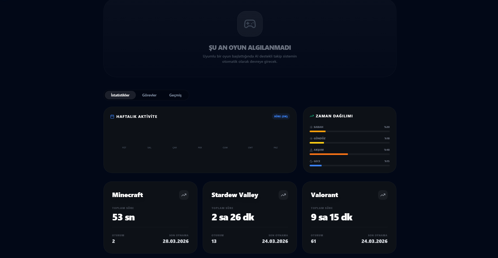
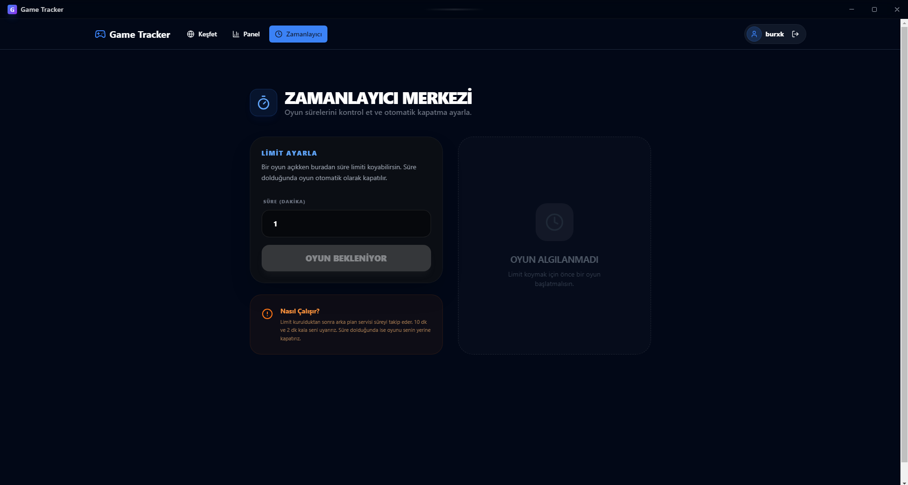
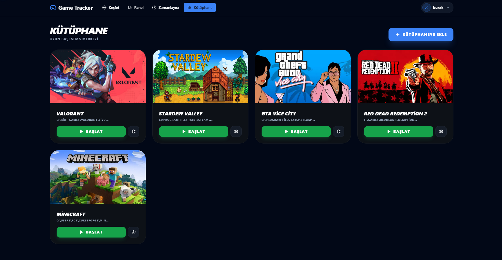
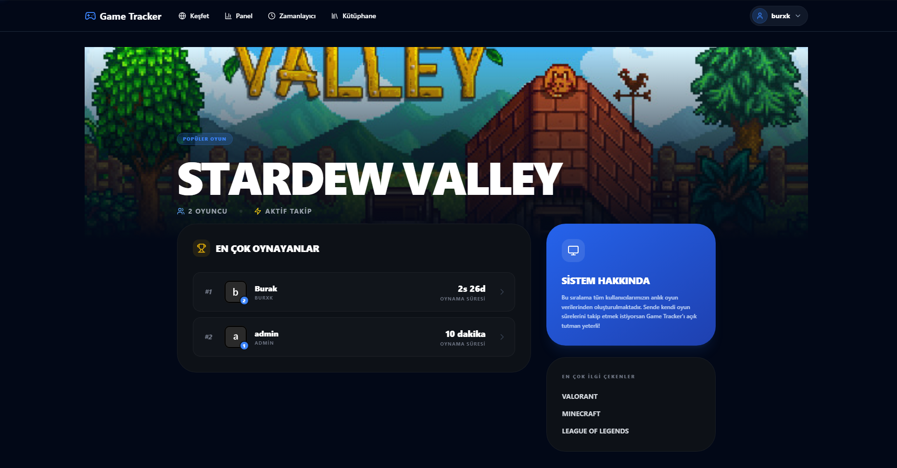
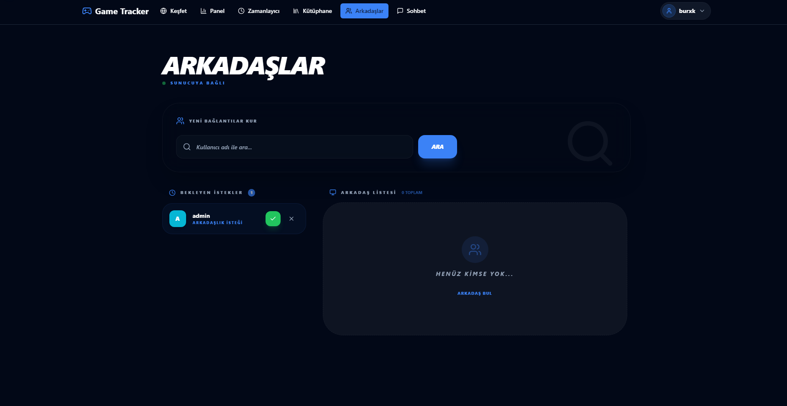
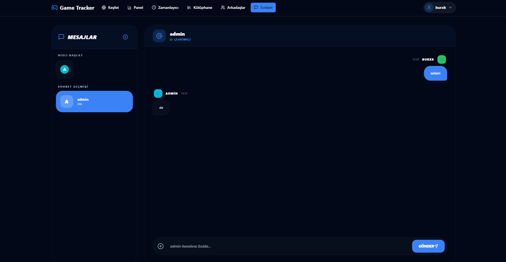

# The Game Tracker

Game Tracker is an application that allows you to record the playtime of your original or cracked games, communicate with other users, and create your profile.

The application is not for downloading games; it allows you to take screenshots of even your cracked games, track playtime, and obtain _achievements_.

## Upcoming Features
> Also: Badges, community, messaging, and screenshot sharing features will be added soon.

## Dashoard Page
The Dashboard Page allows you to access statistics for the games you've played. The "_Playing_" section is also displayed on this page.




## Discover Page
You can explore and search other players' profiles.


## Profile Page
Personalized game profile page: You can add custom avatars and banners. Other users can see your game time, and you can share which games you're playing with other users.


## Timer Page
Game timer helps you enter time while playing a game and turn off your game when that time is up. At the end of the time, it warns you to close the game and then closes the game directly.




## Library Page
The game library detects the game, or you can add and launch it from a single location. It also offers the opportunity to customize games.



## Game Detail Page
It provides a detailed page for the games, listing who plays them the most and which games are being played.



## Friends Page



## Chat Page



## Admin Panel

The Game Tracker includes a powerful admin panel for managing users, monitoring game sessions, and viewing system statistics.

### Admin Panel Features

- **Dashboard Overview**: View total users, admins, game sessions, and popular games
- **User Management**: Search, view, edit roles, and delete users
- **Session Monitoring**: Track all game sessions across the platform
- **Security**: 5 failed login attempts lock the account for 10 minutes
- **Role Management**: Promote users to admin or demote admins to regular users

### Creating an Admin User

To create an admin user, run the following command:

```bash
node api/scripts/createAdmin.js <username> <password> <email>
```

Example:
```bash
node api/scripts/createAdmin.js admin admin123 admin@gametracker.com
```

### Accessing the Admin Panel

Once you have created an admin user, you can access the admin panel at:

```
http://localhost:5173/#/admin
```

Login with your admin credentials to access the dashboard.

### Admin Panel Security

- Failed login attempts are tracked per username
- After 5 failed attempts, the account is locked for 10 minutes
- All login attempts (successful and failed) are logged with IP addresses
- Admin-only routes are protected with role-based authentication middleware